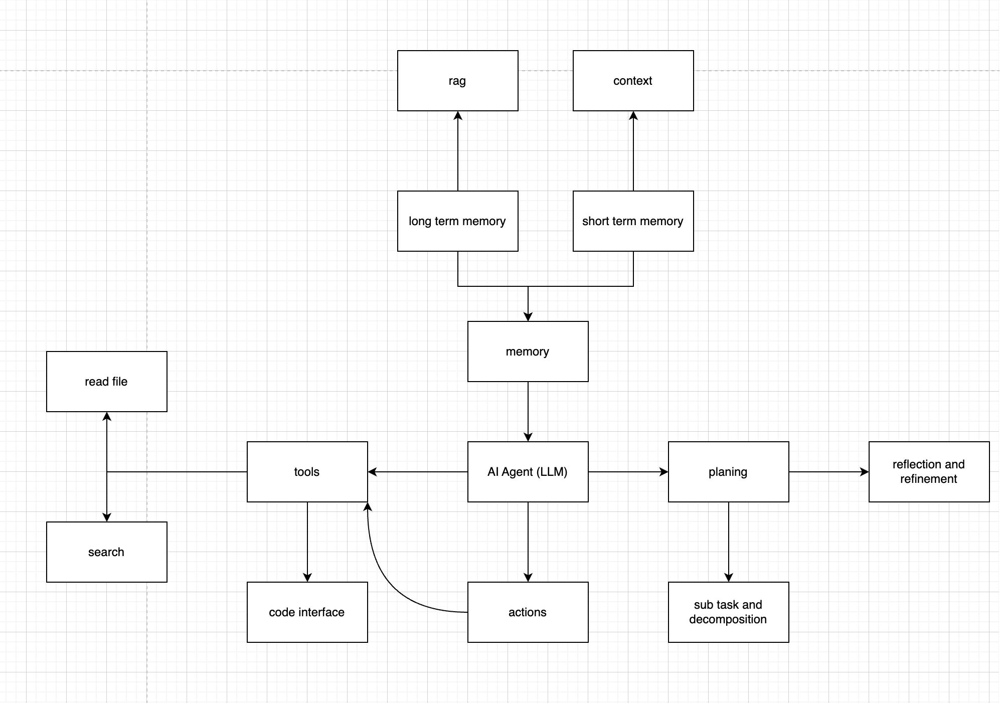

# Common AI Agent



## Overview

Common AI Agent is an AI-powered assistant designed to process complex tasks by leveraging multiple components such as memory, context awareness, planning, and decomposition. It integrates various tools and interfaces to help with real-time actions, reflection, and refinement based on dynamic data. The agent can read files, perform searches, interface with code, and generate solutions through a structured problem-solving flow.

## environments

```

conda create --name common-ai-agent python=3.10


conda activate common-ai-agent
```

## Components

1. **RAG (Retrieval-Augmented Generation)**:

   - Retrieves external knowledge or context to aid in decision-making or response generation.

2. **Memory**:
   - **Short Term Memory**: Stores temporary context for immediate tasks.
   - **Long Term Memory**: Retains more permanent data across sessions for deeper context understanding.
3. **AI Agent (LLM)**:

   - The core language model that processes tasks, interacts with tools, and generates actions.

4. **Tools**:

   - Tools like file readers and code interfaces are used to interact with data and external resources.

5. **Planning**:

   - Generates a plan to approach a task, including decomposition of subtasks into manageable actions.

6. **Actions**:

   - Executes tasks based on the agent’s planning and inputs from the environment (e.g., read files, search the web, interact with code).

7. **Reflection and Refinement**:
   - After executing actions, the agent reflects on the outcome and refines its approach for improved efficiency and accuracy.

## Features

- **File Reading**: Read and process content from files to gather necessary data for task execution.
- **Search**: Perform web or local searches to gather additional context and resources.
- **Code Interface**: Interface with code repositories and systems for programming-related tasks.
- **Task Decomposition**: Break down larger tasks into smaller, manageable subtasks for efficient execution.
- **Contextual Awareness**: Utilize both short-term and long-term memory for enhanced decision-making.
- **Planning and Reflection**: Plan task execution and reflect on outcomes for optimization.
